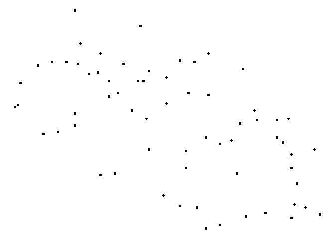
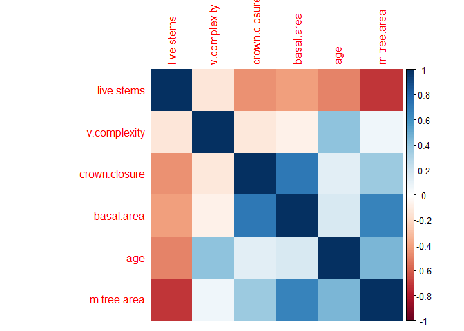
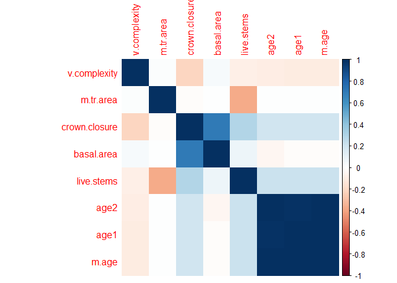
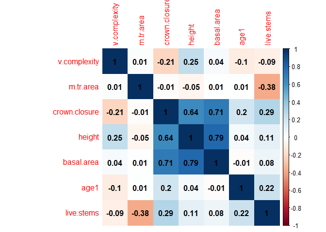

Correlation matrix
================

I have a set of random points drawn from within the 100% MCP for the Skaiakos bird, and each point has a few attributes drawn from the VRI. I'd like to:

-   Plot the points
-   Calculate a new attribute (mean tree size)
-   Graph the different attributes
-   Check for correlation between the attributes

``` r
# Load some libraries.
library('ggplot2')
library('tidyverse')

# Import random points.
ska.random <- read.csv('../data/processed/ska_random_variables.csv', stringsAsFactors=FALSE)

ggplot(ska.random, aes(x=xcoord, y=ycoord)) +
  geom_point() +
  theme_void()
```



I have 65 "used" point so I generated 65 random points to represent the "available" habitat.

Two of the variables I selected are `LIVE_STEMS` which is the number of live stems (ie trees) in the patch, and `BASAL_AREA` which is the total area of all the trees in the patch (larger than some small size). A little math should therefore give me the mean tree area of the patch. Larger should indicated big trees (older seral stage) and smaller should indicate small trees (younger seral stage).

Additionally, the VRI uses a lot of abbreviations and I'll fill those in with something easier on the eye.

``` r
ska.random <- ska.random %>%
  mutate(M_TR_AREA=BASAL_AREA/LIVE_STEMS) %>%
  rename(lat=ycoord, lon=xcoord, age=PROJ_AGE_1, v.complexity=VERT_COMPL, crown.closure=CR_CLOSURE, live.stems=LIVE_STEMS,        basal.area=BASAL_AREA, cover.type=BCLCS_LV_4, m.tree.area=M_TR_AREA)

ska.random %>% distinct(cover.type)
```

    ##   cover.type
    ## 1         TC
    ## 2         TM
    ## 3         TB
    ## 4         SL

``` r
ska.random <- ska.random %>% mutate(cover.type=case_when(
  cover.type == 'TC' ~ 'conifer',
  cover.type == 'TM' ~ 'mixed forest',
  cover.type == 'TB' ~ 'deciduous',
  cover.type == 'SL' ~ 'low shrub'
))
```

I would like to check for correlation among my assorted habitat variables. I'm sure there's quite a bit, since I picked them precisely because they are all related to seral stage. To deal with NAs, I set `use` to `'pairwise'`. This means that observations with a missing value for a given variable are excluded for any analysis with that variable. So if a point is missing vertical complexity value it's excluded from `v.complexity x crown.closure` but still included in `crown.closure x age`.

``` r
# cor() is base R but corrplot makes visualization nicer.
library('corrplot')
c <- ska.random %>% dplyr::select(age, v.complexity, crown.closure, live.stems, basal.area, m.tree.area) %>%
  cor(use='pairwise')

corrplot(c, method='color', order='hclust')
```



This is pretty interesting because `v.complexity` (the number of visible crown layers0 is supposed to be fairly indicative of older seral stages but isn't correlated with crown closure or mean tree area, which should also be indicative of older seral stages. It is somewhat correlated with age, though. Live stems and crown closure are negatively correlated, which makes sense because younger stands have more, skinnier trees and also generally less closed canopies.

Ok, but after all this it occurred to me that there may be a better, more thorough way to do this, which is just upload the entire VRI shapefile (at least, the part for my three sites) and run the correlation analysis on that.

``` r
library('rgdal')

# Import the VRI data.
vri <- readOGR('../data/external/ska_vri.shp')
```

    ## OGR data source with driver: ESRI Shapefile 
    ## Source: "C:\Users\Gwyn\sfuvault\PEEC-talk\data\external\ska_vri.shp", layer: "ska_vri"
    ## with 1001 features
    ## It has 188 fields
    ## Integer64 fields read as strings:  POLY_ID REF_YR_ID CRUISE_NO OPEN_ID ORGUNIT_NO LIVE_STEMS DEAD_STEMS PROJ_AGE_1 PROJ_AGE_2

``` r
# Convert to data frame and do some cleaning.
vri.df <- as.data.frame(vri) %>%
  dplyr::select(treed=BCLCS_LV_2, cover.type=BCLCS_LV_4,
                density=BCLCS_LV_5, age1=PROJ_AGE_1,
                age2=PROJ_AGE_2, v.complexity=VERT_COMPL, 
                crown.closure=CR_CLOSURE, live.stems=LIVE_STEMS, 
                basal.area=BASAL_AREA) %>%
  mutate(live.stems=as.numeric(live.stems), age1=as.numeric(age1),
         age2=as.numeric(age2))

# Assume NOGO only roost in forest.
vri.forest <- vri.df %>%
  filter(treed == 'T') %>%
  mutate(m.tr.area=basal.area/live.stems,
         m.age=rowMeans(dplyr::select(., 4:5))) %>%
  mutate(m.age=case_when(is.na(m.age) ~ as.numeric(age1),
                         TRUE ~ as.numeric(m.age)))
```

So this selected only those variables from the VRI I thought might be interesting, renamed them something more readable, and transformed a few problematic ones from factors to numerics.

Then I picked out all the treed polygons (T=treed, N=not treed, W=water) and calcuated the average tree basal area and the mean age of each stand. Because some stands only have a single age, I filled in any NAs in the average age with the age of the dominant species (`age1`).

``` r
fc <- vri.forest %>% dplyr::select(age1, age2, m.age, v.complexity, 
                                  crown.closure, live.stems, basal.area, 
                                  m.tr.area) %>%
  mutate_if(is.factor, as.numeric) %>%
  cor(use='pairwise')


corrplot(fc, method='color', order='hclust')
```



I included mean stand age because I thought the difference between the dominant and secondary tree ages might make a difference, but they're so strongly correlated it's obvious it doesn't. So dominant tree age will do fine if I need to use age. Because they're pretty correlated, I could use crown closure *or* basal area.

What happens if I rerun this without the calculated age and throw in height.

``` r
# Convert to data frame and do some cleaning.
vri.df2 <- as.data.frame(vri) %>%
  dplyr::select(treed=BCLCS_LV_2, cover.type=BCLCS_LV_4,
                density=BCLCS_LV_5, age1=PROJ_AGE_1,
                height=PROJ_HT_1, v.complexity=VERT_COMPL, 
                crown.closure=CR_CLOSURE, live.stems=LIVE_STEMS, 
                basal.area=BASAL_AREA)

# Assume NOGO only roost in forest.
vri.forest2 <- vri.df2 %>%
  filter(treed == 'T') %>%
  mutate_if(is.factor, as.numeric) %>%
  mutate(m.tr.area=basal.area/live.stems)

fc2 <- vri.forest2 %>% dplyr::select(age1, height, v.complexity, 
                                  crown.closure, live.stems, basal.area, 
                                  m.tr.area) %>%
  cor(use='pairwise')


corrplot(fc2, method='color', order='hclust', addCoef.col='black')
```



Looks like basal area, height, and crown closure are all pretty strongly correlated.
