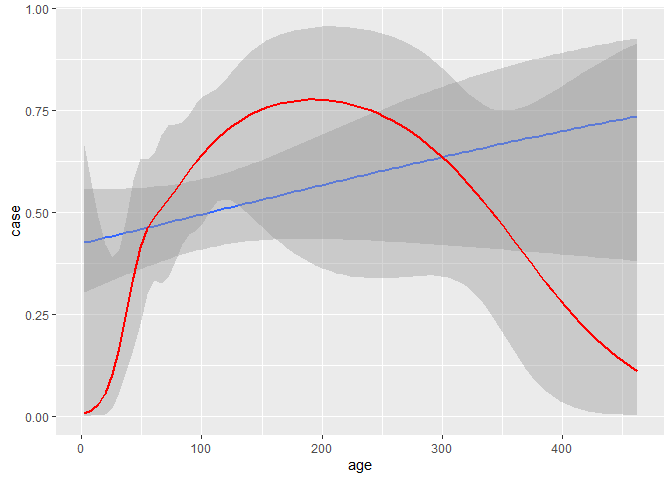
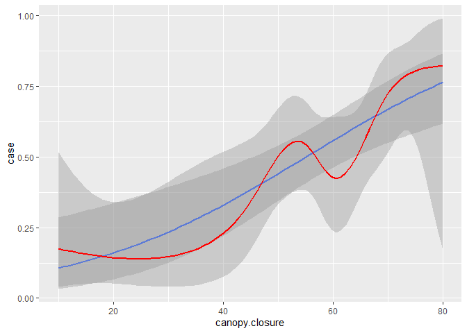
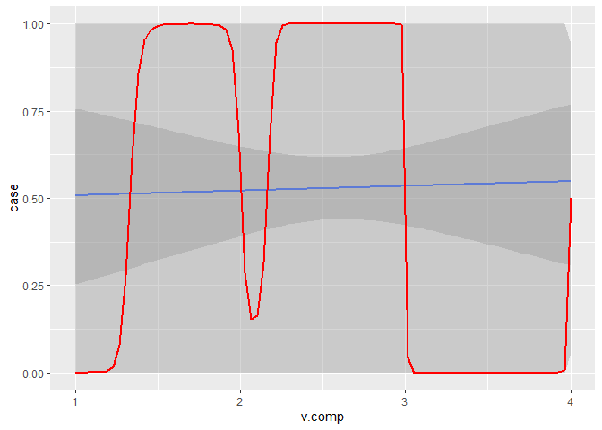
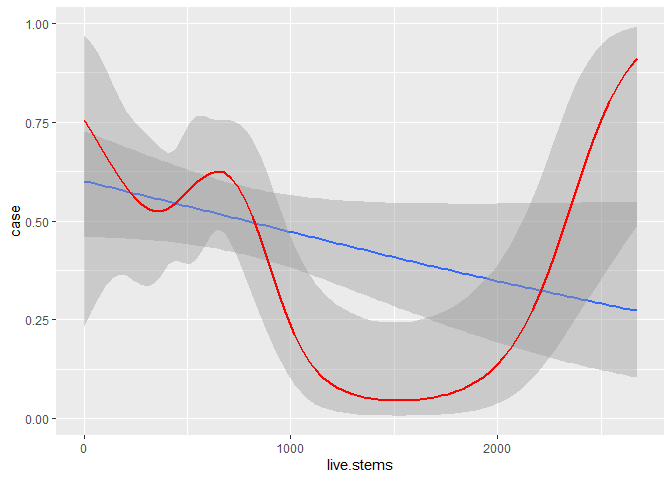
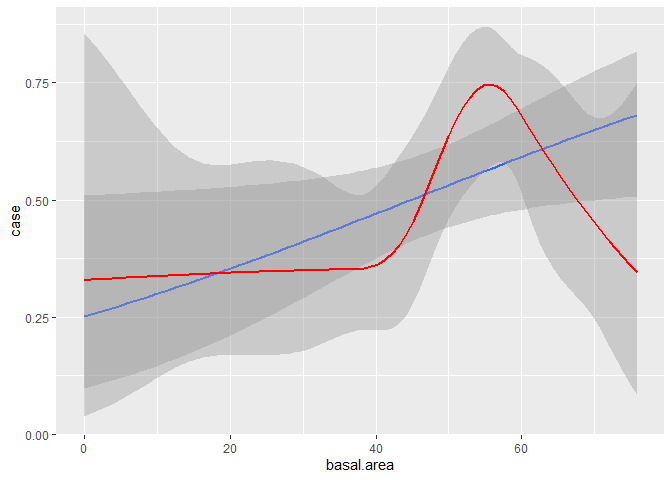
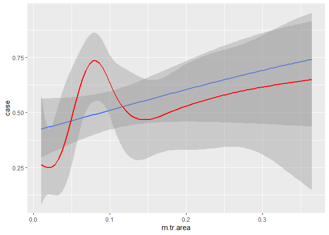
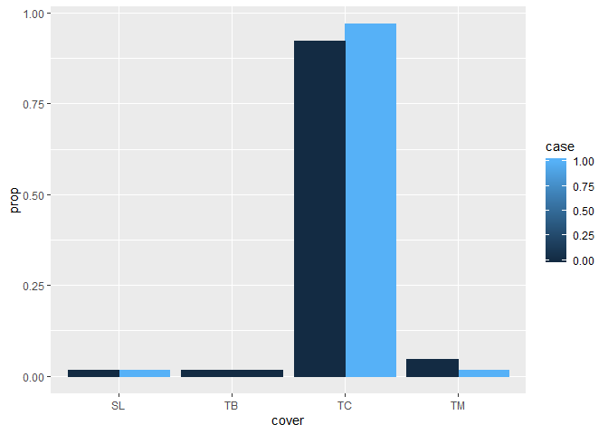

Practice model
================

Just a quick, lousy kind of model to see how it's done. Plan of attack: bring in "used" points, bring in small number of "available" points (which I now realized I selected wrong, but hey, that's why this is a practice run), join them together with a 0/1 to indicate which pool they come from, explore the data a little, then run through a logistic regression.

``` r
# Load some libraries.
library('tidyverse')

# Load the data.
used <- read.csv('../data/processed/h_roost_attributes.csv')
avail <- read.csv('../data/processed/ska_random_variables.csv')

# Clean up the used columns.
used <- used %>% dplyr::select(-day) %>%
  rename(ycoord=m.lat, xcoord=m.lon) %>%
  mutate(case=1)

# Add a case column to the available points, too.
avail <- avail %>%
  mutate(case=0)

# And bind them.
points <- bind_rows(used, avail)

# Annoyingly, it added an id column. Remove that and add mean area.
points <- points %>% dplyr::select(-id) %>%
  mutate(m.tr.area=BASAL_AREA/LIVE_STEMS) %>%
  rename(cover=BCLCS_LV_4, live.stems=LIVE_STEMS, basal.area=BASAL_AREA, canopy.closure=CR_CLOSURE, age=PROJ_AGE_1, v.comp=VERT_COMPL)
```

And now explore the data a little. Let's look at how presence corresponds to some of the variables. This is taken from the [MoveBank workshop](https://movebankworkshopraleighnc.netlify.com/fisherrsf2018)

``` r
library('ggplot2')

binomial_smooth <- function(...) {
  geom_smooth(method = "glm", method.args = list(family = "binomial"), ...)
}

ggplot(points, aes(x=age, y=case)) +
  stat_smooth(method='glm', method.args=list(family='binomial')) +
  binomial_smooth(formula=y ~ splines::ns(x, 5), color='red')
```



``` r
ggplot(points, aes(x=canopy.closure, y=case)) +
  stat_smooth(method='glm', method.args=list(family='binomial')) +
  binomial_smooth(formula=y ~ splines::ns(x, 5), color='red')
```



``` r
ggplot(points, aes(x=v.comp, y=case)) +
  stat_smooth(method='glm', method.args=list(family='binomial')) +
  binomial_smooth(formula=y ~ splines::ns(x, 5), color='red')
```



``` r
ggplot(points, aes(x=live.stems, y=case)) +
  stat_smooth(method='glm', method.args=list(family='binomial')) +
  binomial_smooth(formula=y ~ splines::ns(x, 5), color='red')
```



``` r
ggplot(points, aes(x=basal.area, y=case)) +
  stat_smooth(method='glm', method.args=list(family='binomial')) +
  binomial_smooth(formula=y ~ splines::ns(x, 5), color='red')
```



``` r
ggplot(points, aes(x=m.tr.area, y=case)) +
  stat_smooth(method='glm', method.args=list(family='binomial')) +
  binomial_smooth(formula=y ~ splines::ns(x, 5), color='red')
```



From this it looks like vertical complexity may not have enough data to actually be useful, so I might have to drop it. But maybe with the larger sample size it will be ok.

``` r
ggplot(points, aes(x=cover, y=..prop.., group=case, colour=case)) +
  geom_bar(position="dodge", aes(fill=case))
```



Looks like conifer was used slightly greater than available... and what's up with broadleaf? It looks like there wasn't a random available point for it, but was nonetheless used. So also used more than avaialable. Mixed forest is used less. Oddly, looks like low shrub was also used!

Now to actually make the model.

``` r
# Weight the available data.
points$w <- ifelse(points$case == 1, 1, 5000)

# Build the model.
summary(glm(case ~ age + canopy.closure + m.tr.area + cover, data=points, weight=w, family=binomial))
```

    ## 
    ## Call:
    ## glm(formula = case ~ age + canopy.closure + m.tr.area + cover, 
    ##     family = binomial, data = points, weights = w)
    ## 
    ## Deviance Residuals: 
    ##    Min      1Q  Median      3Q     Max  
    ## -2.326  -1.228   3.740   4.000   4.752  
    ## 
    ## Coefficients:
    ##                  Estimate Std. Error z value Pr(>|z|)    
    ## (Intercept)    -26.980850 346.093427  -0.078   0.9379    
    ## age              0.002921   0.001420   2.057   0.0397 *  
    ## canopy.closure   0.071733   0.015184   4.724 2.31e-06 ***
    ## m.tr.area       -2.403712   2.134991  -1.126   0.2602    
    ## coverTC         14.493690 346.091560   0.042   0.9666    
    ## coverTM         12.969564 346.092848   0.037   0.9701    
    ## ---
    ## Signif. codes:  0 '***' 0.001 '**' 0.01 '*' 0.05 '.' 0.1 ' ' 1
    ## 
    ## (Dispersion parameter for binomial family taken to be 1)
    ## 
    ##     Null deviance: 1212.1  on 124  degrees of freedom
    ## Residual deviance: 1168.6  on 119  degrees of freedom
    ##   (5 observations deleted due to missingness)
    ## AIC: 1180.6
    ## 
    ## Number of Fisher Scoring iterations: 12

Sweet! And what does it mean?? Looks like the real predictor of roost sites is canopy closure, and to a much lesser extent age. Mean basal area and cover type didn't really make a difference. But the deviance is really large so it's not actually a great model anyway.

But that was nice for practice and I'll give it another shot with more points and better variables.
