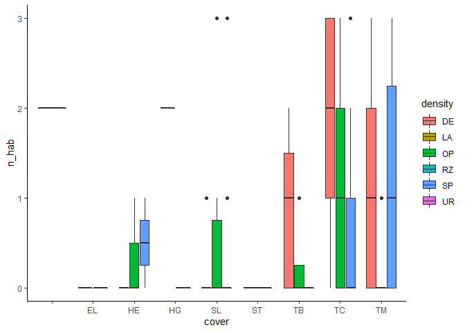

Second model run
================

Good talk! So my action items are:

-   Drop points that are impossible habitat (ie, ranked less than 0 = water)
-   Rescale variables.
-   Check out some interactions between HSI & other variables.
-   Reduce dataset to some lowest common denominator of data.

``` r
# Load some libraries.
library('ggplot2')
library('tidyverse')
library('lme4')

# Read in the points.
points <- read.csv('../h_data/interim/points.csv', stringsAsFactors=FALSE)

p.points <- points %>%
  filter(n_hab >= 0)

ggplot(p.points, aes(x=cover, y=n_hab, fill=density)) +
  theme_classic() +
  geom_boxplot()
```



This tells me I have a problem with my cover and density categories. I need to find a better way to handle the difference categories and how they intercept. Let's start by looking at some of the oddities.

``` r
p.points %>% filter(cover=='')
```

    ##     xcoord  ycoord site case cover density canopy.closure basal.area live.stems
    ## 1 427674.5 5510245  RLK    0            LA             NA         NA         NA
    ##   v.comp dom.sp.per age height f_hab n_hab
    ## 1     NA         NA  NA     NA     3     2

`LA` means lake, so this should have been tossed with other water points. It's impossible to know from looking it it whether the `density` is wrong or the `n_hab` is wrong, but I'll drop it to be safe.

``` r
p.points <- p.points %>% filter(!cover=='')
```

That leaves `RZ` and `UR` as oddities, which are "road surface" and "urban". I think I can collapse those into a single category, say `NL` for "nil."

``` r
p.points <- p.points %>% mutate(density=case_when(
  density=='RZ' ~ 'NL',
  density=='UR' ~ 'NL',
  TRUE ~ density
))

# And then scale the numeric variables.
s.points <- p.points %>% mutate(canopy.closure=scale(canopy.closure), basal.area=scale(basal.area), live.stems=scale(live.stems), v.comp=scale(v.comp), dom.sp.per=scale(dom.sp.per), age=scale(age), height=scale(height))
```

So now that I've scaled things, I can try running the model again just so see if I get the same error.

``` r
sink.corr <- glmer(case ~ canopy.closure + basal.area + density + (1|site), data=s.points, family=binomial(link='logit'))
```

Woohoo! No error messages. So the rescaling thing worked like a charm. Now to figure out my max dataset situation.

``` r
map(p.points, ~sum(is.na(.)))
```

    ## $xcoord
    ## [1] 0
    ## 
    ## $ycoord
    ## [1] 0
    ## 
    ## $site
    ## [1] 0
    ## 
    ## $case
    ## [1] 0
    ## 
    ## $cover
    ## [1] 0
    ## 
    ## $density
    ## [1] 0
    ## 
    ## $canopy.closure
    ## [1] 16
    ## 
    ## $basal.area
    ## [1] 49
    ## 
    ## $live.stems
    ## [1] 12
    ## 
    ## $v.comp
    ## [1] 103
    ## 
    ## $dom.sp.per
    ## [1] 16
    ## 
    ## $age
    ## [1] 16
    ## 
    ## $height
    ## [1] 16
    ## 
    ## $f_hab
    ## [1] 0
    ## 
    ## $n_hab
    ## [1] 0

Part of the problem is that many of these cover classes don't include the variables I'm interested in, since they're mostly forest-related. So obviously shrub points don't have a value for vertical complexity. For example:

``` r
p.points[which(is.na(p.points$live.stems)), ]
```

    ##       xcoord  ycoord site case cover density canopy.closure basal.area
    ## 184 519674.5 5575245  MTC    0    SL      SP             NA         NA
    ## 199 520174.5 5575245  MTC    0    SL      SP             NA         NA
    ## 418 431674.5 5502245  RLK    0    SL      OP             NA         NA
    ## 422 431674.5 5501745  RLK    0    SL      SP             NA         NA
    ## 453 430674.5 5502245  RLK    0    EL      NL             NA         NA
    ## 724 437674.5 5488745  SKA    0    HG      SP             NA         NA
    ## 725 437674.5 5488245  SKA    0    HG      SP             NA         NA
    ## 734 437174.5 5486745  SKA    0    SL      SP             NA         NA
    ## 767 440674.5 5485245  SKA    0    SL      SP             NA         NA
    ## 780 440174.5 5487245  SKA    0    SL      SP             NA         NA
    ## 781 440174.5 5486245  SKA    0    SL      SP             NA         NA
    ## 786 520174.5 5574245  MTC    0    EL      NL             NA         NA
    ##     live.stems v.comp dom.sp.per age height f_hab n_hab
    ## 184         NA     NA         NA  NA     NA     1     0
    ## 199         NA     NA         NA  NA     NA     1     0
    ## 418         NA     NA         NA  NA     NA     1     0
    ## 422         NA     NA         NA  NA     NA     3     1
    ## 453         NA     NA         NA  NA     NA     0     0
    ## 724         NA     NA         NA  NA     NA     1     0
    ## 725         NA     NA         NA  NA     NA     1     0
    ## 734         NA     NA         NA  NA     NA     1     0
    ## 767         NA     NA         NA  NA     NA     1     0
    ## 780         NA     NA         NA  NA     NA     1     0
    ## 781         NA     NA         NA  NA     NA     1     0
    ## 786         NA     NA         NA  NA     NA     0     0

This means either I'm very limited in the questions I can ask, or I have to fill in some of those missing values with something interesting. If I drop the missing values, this means I need to restrict myself to forested points, so I can ask:

*out of all the forest available, what best predicts the kind of forest where NOGO choose to roost?*

If I fill in as many missing values as I reasonably can, then I can ask a broader question:

*out of all the land available, what best predicts the kind of land where NOGO choose to roost?*

The second question feels better, but since I already know they're only roosting in forest anyway, does dropping non-forested points make any less sense than dropping water points?

Well, the obvious answer is to cheat and run it both ways. But looking closer at the data I feel like I'm not confident in interpreting some of these numbers outside the category of forest. Yes, it makes sense that a shrub point doesn't have any data for basal area, but what does it mean when the points has 16% crown closure?? Or 1000 live stems/ha?? So maybe it would be better to stick to the tree points.

``` r
f.points <- s.points %>% filter(cover %in% c('TC', 'TM', 'TB')) %>%
  drop_na()

f.points %>% group_by(case) %>%
  summarize(n())
```

    ## # A tibble: 2 x 2
    ##    case `n()`
    ##   <int> <int>
    ## 1     0   567
    ## 2     1    97

That gives me a much smaller dataset (there were still about 80 points without vertical complexity). Hopefully that will be enough! Then from here I can make some plausible candidate models. One set, obviously, is just the HSI.

-   case ~ n\_hab
-   case ~ f\_hab

Then I can add some things that might be help boost the HSI. A study on NOGO roosting in Lassen, CA found basal area was a good predictor. Tree species was also a good predictor, but this is included in the HSI already. Canopy closure is obvious, as is vertical complexity.

-   case ~ n\_hab + basal.area
-   case ~ n\_hab + canopy.closure
-   case ~ n\_hab + v.comp

Unless f\_hab does really good on it's own, I don't think I'll bother "bosting" it. I can also try these variables on their own.

-   case ~ basal.area
-   case ~ canopy.closure
-   case ~ v.comp

``` r
# "Boost" models.
b.basal <- glmer(case ~ n_hab + basal.area + (1|site), data=f.points, family=binomial(link='logit'))

b.canopy <- glmer(case ~ n_hab + canopy.closure + (1|site), data=f.points, family=binomial(link='logit'))

b.comp <- glmer(case ~ n_hab + v.comp + (1|site), data=f.points, family=binomial(link='logit'))

# "Solo" models.
s.basal <- glmer(case ~ basal.area + (1|site), data=f.points, family=binomial(link='logit'))

s.canopy <- glmer(case ~ canopy.closure + (1|site), data=f.points, family=binomial(link='logit'))

s.comp <- glmer(case ~ v.comp + (1|site), data=f.points, family=binomial(link='logit'))

# And of course habitat models.
n.hab <- glmer(case ~ n_hab + (1|site), data=f.points, family=binomial(link='logit'))

f.hab <- glmer(case ~ f_hab + (1|site), data=f.points, family=binomial(link='logit'))

# Check what pops out.
aic <- AIC(b.basal, b.canopy, b.comp, s.basal, s.canopy, s.comp, n.hab, f.hab)

aic %>% rownames_to_column() %>%
  arrange(AIC)
```

    ##    rowname df      AIC
    ## 1 b.canopy  4 541.5736
    ## 2 s.canopy  3 544.1367
    ## 3    n.hab  3 545.7322
    ## 4    f.hab  3 546.7163
    ## 5   b.comp  4 546.9281
    ## 6  b.basal  4 547.0519
    ## 7  s.basal  3 550.3979
    ## 8   s.comp  3 552.6800

So unsurprisingly, adding canopy cover was an improvement over nesting habitat alone. What was surprising was that canopy cover, all on its own, is *still* better than the nesting habitat model. Also, distance from edge is included in the n\_hsi and could conceivably be dragging it down... would be interesting to test canopy closure + f\_hab.

The only potential problem I can see here is that canopy cover may not be evenly distributed among my points. That is, by dropping points without canopy cover I somehow biased my data. I'll have to check that next.
