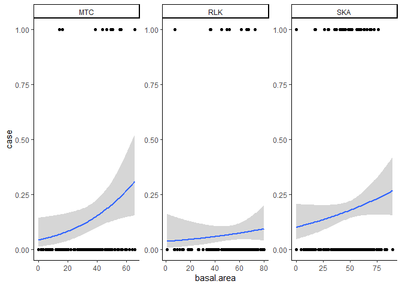
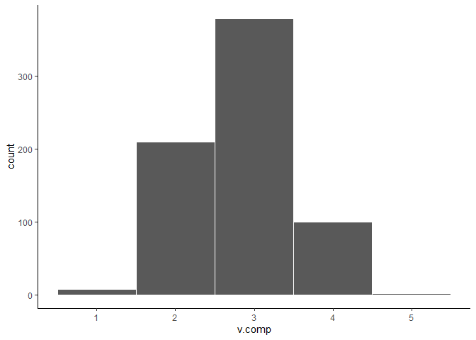

Variables
================

Now that I have the "final" variables (hahaha yeah right) let's try another correlation plot.

``` r
# Load some libraries.
library('ggplot2')
library('tidyverse')
library('corrplot')

# Load in the data.
used <- read.csv('../data/processed/h_used_utm.csv', stringsAsFactors=FALSE)

avail <- read.csv('../data/processed/available_utm.csv', stringsAsFactors=FALSE)

# Do some cleanup.
used <- used %>%
  dplyr::select(-field_1, -day, -m.lat, -m.lon) %>%
  mutate(case=1)

avail <- avail %>%
  dplyr::select(-id) %>%
  mutate(case=0)

# ...and in the darkness bind them!
points <- bind_rows(used, avail)

# A little more cleanup.
points <- points %>% 
  rename(cover=BCLCS_LV_4, density=BCLCS_LV_5,live.stems=LIVE_STEMS, basal.area=BASAL_AREA, canopy.closure=CR_CLOSURE, v.comp=VERT_COMPL, age=PROJ_AGE_1, height=PROJ_HT_1, dom.sp.per=SPEC_PCT_1) %>%
  dplyr::select(xcoord, ycoord, site, case, cover, density, everything())

# Save for later.
write.csv(points, '../data/interim/points.csv', row.names=FALSE)

c <- points %>%
  dplyr::select(7:15) %>%
  cor(use='pairwise')

corrplot(c, method='color', order='hclust', addCoef.col='black', number.digits=1)
```


So that's correlation. Now let's look at all of the variables.

``` r
ggplot(points, aes(x=canopy.closure, y=case)) +
  geom_point() +
  theme_classic() +
  stat_smooth(method='glm', method.args=list(family='binomial')) +
  facet_wrap(~site, scales='free')
```


``` r
ggplot(points, aes(x=basal.area, y=case)) +
  geom_point() +
  theme_classic() +
  stat_smooth(method='glm', method.args=list(family='binomial')) +
  facet_wrap(~site, scales='free')
```



``` r
ggplot(points, aes(x=live.stems, y=case)) +
  geom_point() +
  theme_classic() +
  stat_smooth(method='glm', method.args=list(family='binomial')) +
  facet_wrap(~site, scales='free')
```


``` r
ggplot(points, aes(x=v.comp, y=case)) +
  geom_point() +
  theme_classic() +
  stat_smooth(method='glm', method.args=list(family='binomial')) +
  facet_wrap(~site, scales='free')
```


``` r
ggplot(points, aes(x=dom.sp.per, y=case)) +
  geom_point() +
  theme_classic() +
  stat_smooth(method='glm', method.args=list(family='binomial')) +
  facet_wrap(~site, scales='free')
```


``` r
ggplot(points, aes(x=age, y=case)) +
  geom_point() +
  theme_classic() +
  stat_smooth(method='glm', method.args=list(family='binomial')) +
  facet_wrap(~site, scales='free')
```


``` r
ggplot(points, aes(x=height, y=case)) +
  geom_point() +
  theme_classic() +
  stat_smooth(method='glm', method.args=list(family='binomial')) +
  facet_wrap(~site, scales='free')
```


``` r
ggplot(points, aes(x=f_hab, y=case)) +
  geom_point() +
  theme_classic() +
  stat_smooth(method='glm', method.args=list(family='binomial')) +
  facet_wrap(~site, scales='free')
```


``` r
ggplot(points, aes(x=n_hab, y=case)) +
  geom_point() +
  theme_classic() +
  stat_smooth(method='glm', method.args=list(family='binomial')) +
  facet_wrap(~site, scales='free')
```


``` r
ggplot(points, aes(x=cover, y=..prop.., group=case, colour=case)) +
  geom_bar(position="dodge", aes(fill=case)) +
  facet_wrap(~site, scales='free')
```


``` r
ggplot(points, aes(x=density, y=..prop.., group=case, colour=case)) +
  geom_bar(position="dodge", aes(fill=case)) +
  facet_wrap(~site, scales='free')
```


``` r
ggplot(points, aes(x=v.comp, y=..prop.., group=case, colour=case)) +
  geom_bar(position="dodge", aes(fill=case)) +
  facet_wrap(~site, scales='free')
```


So that's that, but what I should have done first is just plain look at the variables on their own.

``` r
ggplot(points, aes(x=canopy.closure)) +
  geom_histogram(binwidth=10, color='white') +
  theme_classic()
```


``` r
ggplot(points, aes(x=basal.area)) +
  geom_histogram(binwidth=10, color='white') +
  theme_classic()
```


``` r
ggplot(points, aes(x=live.stems)) +
  geom_histogram(binwidth=50, color='white') +
  theme_classic()
```


``` r
ggplot(points, aes(x=v.comp)) +
  geom_histogram(binwidth=1, color='white') +
  theme_classic()
```



``` r
ggplot(points, aes(x=dom.sp.per)) +
  geom_histogram(binwidth=10, color='white') +
  theme_classic()
```


``` r
ggplot(points, aes(x=age)) +
  geom_histogram(binwidth=50, color='white') +
  theme_classic()
```


``` r
ggplot(points, aes(x=height)) +
  geom_histogram(binwidth=5, color='white') +
  theme_classic()
```


``` r
ggplot(points, aes(x=f_hab)) +
  geom_histogram(binwidth=1, color='white') +
  theme_classic()
```


``` r
ggplot(points, aes(x=n_hab)) +
  geom_histogram(binwidth=1, color='white') +
  theme_classic()
```


Some of these look a little wonky...
