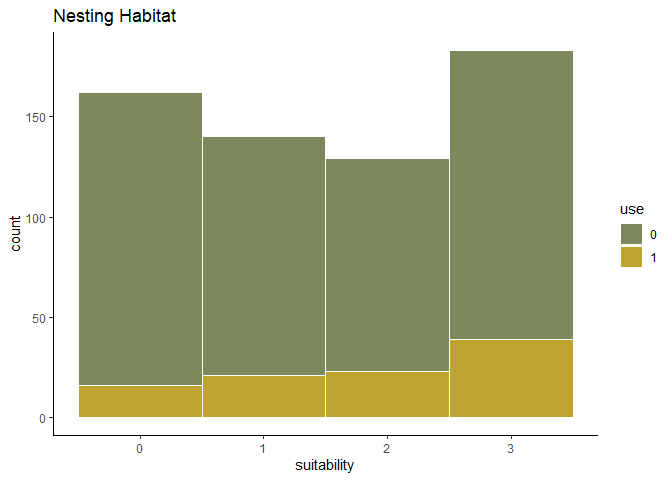
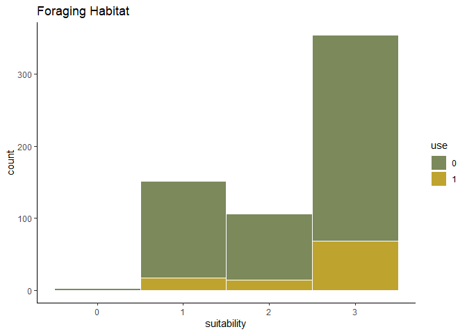
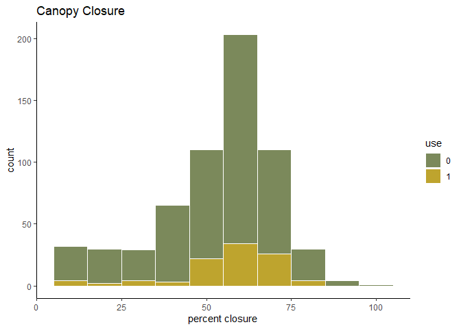
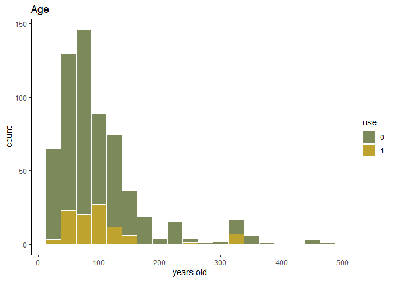
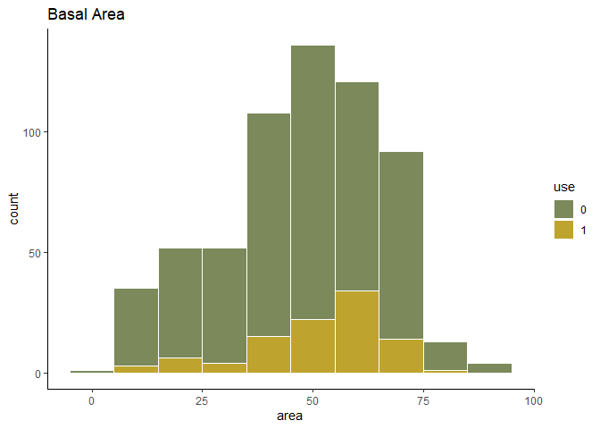

Model visualization
================

So I've got my models, let's look at them a little closer.

``` r
# Load some libraries.
library('ggplot2')
library('tidyverse')
library('lme4')
library('AICcmodavg')

# Read in the points.
points <- read.csv('../h_data/interim/points.csv', stringsAsFactors=FALSE)

# Get the final data set.
n.points <- points %>%
  filter(n_hab >= 0) %>%
  filter(cover %in% c('TC', 'TM', 'TB')) %>%
  select(-v.comp) %>%
  drop_na()

# Not going to bother with basal area transformation.

# Build the models. I'll do just the top five from previously.
b.canopy <- glmer(case ~ n_hab + canopy.closure + (1|site), data=n.points, family=binomial(link='logit'))

fb.canopy <- glmer(case ~ f_hab + canopy.closure + (1|site), data=n.points, family=binomial(link='logit'))

s.canopy <- glmer(case ~ canopy.closure + (1|site), data=n.points, family=binomial(link='logit'))

n.hab <- glmer(case ~ n_hab + (1|site), data=n.points, family=binomial(link='logit'))

can.age <- glmer(case ~ age + canopy.closure + (1|site), data=n.points, family=binomial(link='logit'))

models <- c(b.canopy, fb.canopy, s.canopy, n.hab, can.age)

modnames <- c('canopy + nest hab', 'canopy + f hab', 'canopy alone', 'nest hab alone', 'canopy + age')

aictab(models, modnames=modnames)
```

    ## 
    ## Model selection based on AICc:
    ## 
    ##                   K   AICc Delta_AICc AICcWt Cum.Wt      LL
    ## canopy + nest hab 4 561.34       0.00   0.48   0.48 -276.64
    ## canopy + f hab    4 562.33       0.99   0.29   0.78 -277.13
    ## canopy alone      3 564.32       2.98   0.11   0.89 -279.14
    ## nest hab alone    3 565.46       4.12   0.06   0.95 -279.71
    ## canopy + age      4 565.84       4.51   0.05   1.00 -278.89

The package defaulted me to AICc, which is not a bad thing considering my sample size.

Based on some general rules of thumb, there's pretty equal support for canopy alone or canopy paired with either habitat model. However, neither habitat model alone has strong support.

I also forgot to do a null model, sooo...

``` r
# Site-only model.
site <- glmer(case ~ 1 + (1|site), data=n.points, family=binomial(link='logit'))

models <- c(b.canopy, fb.canopy, s.canopy, n.hab, can.age, site)

modnames <- c('canopy + nest hab', 'canopy + f hab', 'canopy alone', 'nest hab alone', 'canopy + age', 'site')

aictab(models, modnames=modnames)
```

    ## 
    ## Model selection based on AICc:
    ## 
    ##                   K   AICc Delta_AICc AICcWt Cum.Wt      LL
    ## canopy + nest hab 4 561.34       0.00   0.48   0.48 -276.64
    ## canopy + f hab    4 562.33       0.99   0.29   0.78 -277.13
    ## canopy alone      3 564.32       2.98   0.11   0.89 -279.14
    ## nest hab alone    3 565.46       4.12   0.06   0.95 -279.71
    ## canopy + age      4 565.84       4.51   0.05   1.00 -278.89
    ## site              2 571.91      10.58   0.00   1.00 -283.95

And maybe try some basic visualizations of the data...

``` r
# Plot case ~ n hab.
g.nhab <- ggplot(n.points, aes(x=n_hab, fill=factor(case))) +
  geom_histogram(color='white', position = 'identity', binwidth=1) +
  theme_classic() +
  scale_color_manual(values=c("#999999", "#E69F00")) +
  theme(text=element_text(family='Lato')) +
  # First goes in back
  scale_fill_manual(values=c('#7B895B', '#BEA42E')) +
  labs(x='suitability', y='count', fill='use', title='Nesting Habitat')

g.nhab
```



``` r
# Plot case ~ f hab.
g.fhab <- ggplot(n.points, aes(x=f_hab, fill=factor(case))) +
  geom_histogram(color='white', position = 'identity', binwidth=1) +
  theme_classic() +
  scale_color_manual(values=c("#999999", "#E69F00")) +
  theme(text=element_text(family='Lato')) +
  # First goes in back
  scale_fill_manual(values=c('#7B895B', '#BEA42E')) +
  labs(x='suitability', y='count', fill='use', title='Foraging Habitat')

g.fhab
```



``` r
# Plot case ~ canopy.
g.can <- ggplot(n.points, aes(x=canopy.closure, fill=factor(case))) +
  geom_histogram(color='white', position = 'identity', binwidth=10) +
  theme_classic() +
  scale_color_manual(values=c("#999999", "#E69F00")) +
  theme(text=element_text(family='Lato')) +
  # First goes in back
  scale_fill_manual(values=c('#7B895B', '#BEA42E')) +
  labs(x='percent closure', y='count', fill='use', title='Canopy Closure')

g.can
```



``` r
# Plot case ~ age.
g.age <- ggplot(n.points, aes(x=age, fill=factor(case))) +
  geom_histogram(color='white', position = 'identity', binwidth=25) +
  theme_classic() +
  scale_color_manual(values=c("#999999", "#E69F00")) +
  theme(text=element_text(family='Lato')) +
  # First goes in back
  scale_fill_manual(values=c('#7B895B', '#BEA42E')) +
  labs(x='years old', y='count', fill='use', title='Age')

g.age
```



``` r
# Plot case ~ basal area.
g.basal <- ggplot(n.points, aes(x=basal.area, fill=factor(case))) +
  geom_histogram(color='white', position = 'identity', binwidth=10) +
  theme_classic() +
  scale_color_manual(values=c("#999999", "#E69F00")) +
  theme(text=element_text(family='Lato')) +
  # First goes in back
  scale_fill_manual(values=c('#7B895B', '#BEA42E')) +
  labs(x='area', y='count', fill='use', title='Basal Area')

g.basal
```



Okay, that's all nice and pretty. Now to export them for a presentation.

``` r
ggsave('../reports/uvav_nhab.jpg', plot=g.nhab)
ggsave('../reports/uvav_fhab.jpg', plot=g.fhab)
ggsave('../reports/uvav_can.jpg', plot=g.can)
ggsave('../reports/uvav_age.jpg', plot=g.age)
ggsave('../reports/uvav_basal.jpg', plot=g.basal)
```
